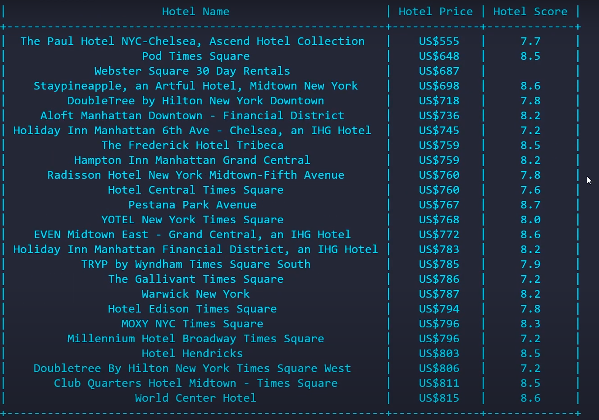

# 🏨 Booking.com Deal Bot

A Python automation bot using **Selenium** that searches for the best hotel deals on [Booking.com](https://www.booking.com) based on your preferences. This is perfect for automating price lookups and deal comparisons for accommodations.

---

## ⚙️ Features

- Automates search queries on Booking.com  
- Extracts hotel names, prices, ratings, and other key details  
- Can be customized for location, dates, number of guests, and more  
- Saves extracted results to a file  
- Simple and adaptable core logic for deal-finding tasks  

---

## 🧠 Concept Behind the Bot

This bot simulates a real user's interaction with [Booking.com](https://www.booking.com) to automate hotel deal searches using the **Selenium** web automation tool.

Here's how it works:

1. **Browser Launch**: Selenium opens a Chrome browser session.
2. **Input Handling**: The user enters a destination, check-in/check-out dates, and number of guests.
3. **Search Automation**: The bot fills in the search form on Booking.com and submits it.
4. **Result Extraction**: It waits for the results page to load and extracts hotel data (like name, price, ratings) using **CSS selectors**.
5. **Display/Store Results**: The collected information is either displayed or stored for further use.

The core idea is to automate repetitive tasks that would otherwise be done manually, saving time and effort while keeping the approach adaptable for future improvements.

---

## ⚠️ Warning & Future Compatibility

> **Disclaimer:** This bot relies on the **CSS classes and layout structure** of the Booking.com website.

Websites like Booking.com regularly update their frontend, which means:
- The bot may stop working correctly if the CSS selectors used in the script become outdated.
- You may need to manually inspect the updated site structure and adjust the selectors accordingly.

However, the **core concept and logic of the bot remain valid**. Only minor updates to the CSS selectors are usually required to restore functionality.

---

## ✅ To-Do / Future Improvements

- [ ] Add support for scraping multiple pages of results
- [ ] Export scraped data to `.csv` or `.xlsx` files
- [ ] Implement headless mode for background execution
- [ ] Add error handling for network and loading issues
- [ ] Use command-line arguments for input flexibility
- [ ] Introduce logging for better debugging and traceability
- [ ] Refactor code into modular functions or classes
- [ ] Add unit tests to ensure reliability and maintainability

---

## 📸 Output Example

Here is a sample output from a typical run:



> *(Output format may vary depending on screen size and Booking.com layout)*

---

## 📄 Requirements

Make sure you have **Python** installed on your system. This project uses the following Python packages:

- `selenium`
- `prettytable`

Install them using these commands:

- pip install selenium
- pip install prettytable

## 🚀 How to Use

1. **Clone the repository:**
   ```bash
   git clone https://github.com/YashJain705/Booking-Com-Deal-Bot.git
   cd Booking-Com-Deal-Bot
